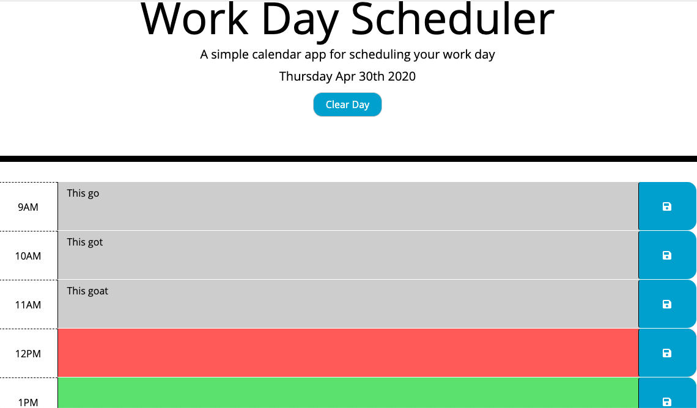

# Day-Planner

## Summary 

This application is a simple calander that run's in the browser. The application allows the user to save tasks in local storage so scheduled events for each hour time block will be displayed anytime the application is open. The application feature's dynamically updated HTML and CSS powered by jQuery. The app works off stanard business hours (9 a.m. to 5 p.m.) which are displayed along the left hand side of each input row. Depending on the time of day, the schedule text imput areas are updated with their color indicating to the user if items are in the past, present or future. After the day has ended the user can easily reset the application with the "Clear Daily Schedule" button at the top of the page. For best use save the url to a bookmark tab to access in browser throughout the day. 

### Technologies Used
- jQuery - Used for event listeners of parent and childeren elements as well as to store and recall those varible in local storage.
- momentjs - Used to pull current date and local time.
- javascript - Used to dynamically change html and display current day and date.
- Bootstrap - Used to pull existing html and CSS for creating resposive organizational structer and styling for the site.
- HTML - Used to create elements on the DOM.
- CSS - Styles html elements on page.
- GitHub - Hosts repository that can be deployed to GitHub Pages.

